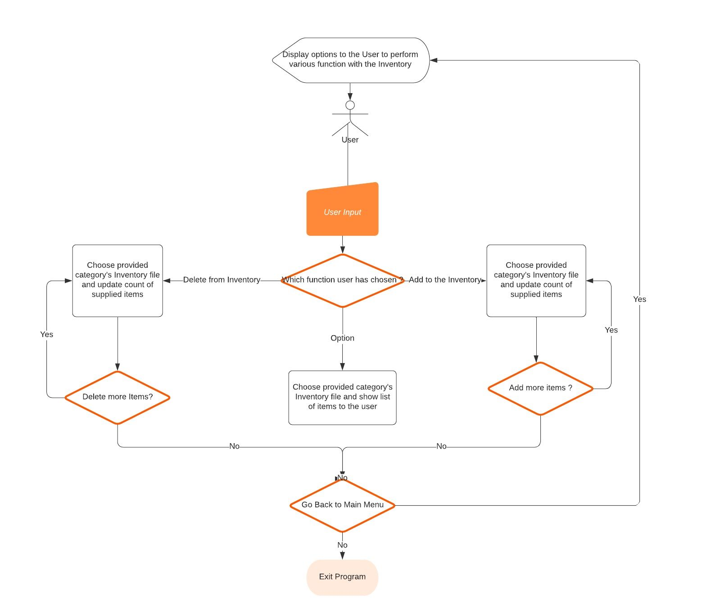
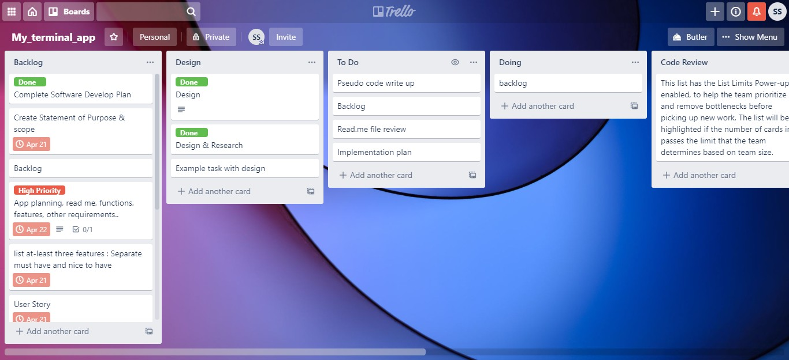

Terminal_App developments Links :
https://github.com/SurendraSapkale/Terminal_APP.git
https://trello.com/b/fBwZKWcm/myterminalapp

### Statement of Purpose and Scope

Restaurant Inventory App  is an essential part of successful and well-organized business organization to manage inventory system in more effective and efficient manner. This App is designed to provide accurate information on all aspects of inventory to control the stock levels (whether inventory items are over stocked or out of stock) for an enterprise. 

**What this App will do**

This APP will help to improve profits and efficiency for restaurants. Restaurants owners and managers will be able to easily regulate their stock. This will ensure that the restaurant always has ready stock avoiding delays and lack of certain food because of lack of supplies. 

This APP will help restaurant to save time and expenses. Capital spent on people and resources used to deal with stock calculations and tracking will no longer be necessary. The system will be able to do this on its own hence enabling restaurants to save money. 

It will provide inventory information such as:

- Add new stock into the inventory
- Update the inventory with used up stock
- Provide a report of items that need to be ordered

**Who will benefit from this App**

Inventory App becomes a crucial part of small, mid and large hospitality business organizations to manage inventory system in accurate manner. This inventory app is specially designed for following users:

- Hospitality Managers/Chefs
- Restaurant & Cafes
- Hotesl & More..

**How it will help the audience**

The Chef's and Restaurant Managers will be able to keep up to date track of their of their Inventory.

## Features

**Add newly arrived Stock**

Here the user will be able to update the inventory with newly arrived stock. This will update the respective category tables with the current stock on hand.

**Delete used stock from the Inventory**

The user will be able to delete the item from the Inventory which has been consumed for the day, this will keep track of correct record of stock on hand

**View current Inventory or list of Items to be purchased.**

User to view his inventory in the form of a nice table. The user can save the inventory items in a a file

Nice to have features**

- **Auto reminder for depleting stock items**.

  This will be a very helpful feature for the user. Instead of checking the Inventory file every time and checking for depleting stock items manually, the application will send an automated report file with all the depleting stock items that needs to be ordered. The application will check the stock on hand with the required quantity, and will list down all the items with depleting quantity in the report file and mail it to the user. This function will need to be auto triggered at a particular time of the day, or could be made ad-hoc.

- **Unit conversion for different types of stock**

Currently the application is handling the quantity of items in only one type of unit. For example Meat in Kg. If an auto unit conversion mechanism is implemented then it will make the application more flexible, as user will get to choose between different unit types.

- **Addition of new category or new stock item.**

This feature will be an added advantage to the application, and will add to the flexibility of the application. 

 

 

#### UI and UX 

On the terminal the user will be provided with a welcome message and option to choose what action is needed by the user. If user chooses to add new stock items then it will be provided with various categories under which the stock needs to be updated. If user wants to update the inventory for used up stock then again the user will be provided various categories and options to update it. The user can also view the current stock on hand and items that need to be ordered.

##### Control Flow Chart

### Implementation Plan

I used Trello to manage my application production by setting timeline of building this app.  Using the Trello board allowed me to keep track of every task I needed to complete, as well as organise the process better.

###### Trello Board

#### Gems used to develop this App

Inventory App makes makes use of a number of Gems to improve the user experience and enhance the overall functionality of the game. All of these gems are stored in the Gemfile.

source "https://rubygems.org"

- gem "colorize"
- gem "fileutils"
- gem "terminal-table"
- gem "tty-prompt"

Testing Log

| Feature                                                      | Expected Outcome                                             | Actual Outcome | Any remaining issues? |
| ------------------------------------------------------------ | ------------------------------------------------------------ | -------------- | --------------------- |
| User wants to add items to the inventory                     | Application takes the feature option, category, item name and number and updates it in the respective category file. | As expected    | Nil                   |
| User wants to delete items from the inventory                | Application takes the feature option, category, item name and number and updates it in the respective category file. | As expected    | Nil                   |
| User wants to view the inventory                             | Application takes the  feature option and category, and provides user with all the items under that category inventory file in terminal table. | As expected    | Nil                   |
| User gets to add or delete as many items as required under a particular category | After every update application checks with user if any more items are required to to be added, if yes it back in the loop. | As expected    | Nil                   |
| User should get the option to back to main menu if no more additions or deletions | If no more additions or deletions the user gets option to go back to main menu or exit the application | As expected    | Nil                   |
| After viewing the inventory user should get option to back to main menu | After viewing the inventory user gets option to go back to main menu or exit the application | As expected    | Nil                   |
| For numeric options user has to provide the appropriate option number. | If user provided option is non-numeric the application should throw appropriate error message and exit the application. | As expected    | Nil                   |
|                                                              |                                                              |                |                       |

