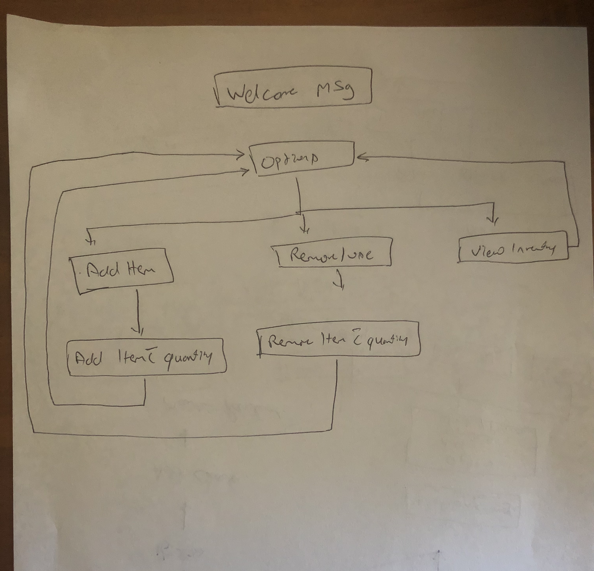

### Statement of Purpose and Scope

Restaurant Inventory App  is an essential part of successful and well-organized business organization to manage inventory system in more effective and efficient manner. This App is designed to provide accurate information on all aspects of inventory to control the stock levels (whether inventory items are over stocked or out of stock) for an enterprise. 

**What this App will do**

This APP will help to improve profits and efficiency for restaurants. Restaurants owners and managers will be able to easily regulate their stock. This will ensure that the restaurant always has ready stock avoiding delays and lack of certain food because of lack of supplies. 

This APP will help restaurant to save time and expenses. Capital spent on people and resources used to deal with stock calculations and tracking will no longer be necessary. The system will be able to do this on its own hence enabling restaurants to save money. 

It will provide inventory information such as:

- Add new stock into the inventory
- Update the inventory with used up stock
- Provide a report of items that need to be ordered

**Who will benefit from this App**

Inventory App becomes a crucial part of small, mid and large hospitality business organizations to manage inventory system in accurate manner. This inventory app is specially designed for following users:

- Hospitality Managers/Chefs
- Restaurant & Cafes
- Hotesl & More..

**How it will help the audience**

The Chef's and Restaurant Managers will be able to keep up to date track of their of their Inventory.

## Features

**Add newly arrived Stock**

Here the user will be able to update the inventory with newly arrived stock. This will update the respective category tables with the current stock on hand.

**Delete used stock from the Inventory**

The user will be able to delete the item from the Inventory which has been consumed for the day, this will keep track of correct record of stock on hand

**View current Inventory or list of Items to be purchased.**

User to view his inventory in the form of a nice table. The user can save the inventory items in a a file

 

#### UI and UX 

On the terminal the user will be provided with a welcome message and option to choose what action is needed by the user. If user chooses to add new stock items then it will be provided with various categories under which the stock needs to be updated. If user wants to update the inventory for used up stock then again the user will be provided various categories and options to update it. The user can also view the current stock on hand and items that need to be ordered.

##### Control Flow Diagram

###### Trello board Set Up! (./docs/Trello_board.jpg)
 

Trello link :
https://trello.com/b/fBwZKWcm/myterminalapp

Nice to have feature (TBA)